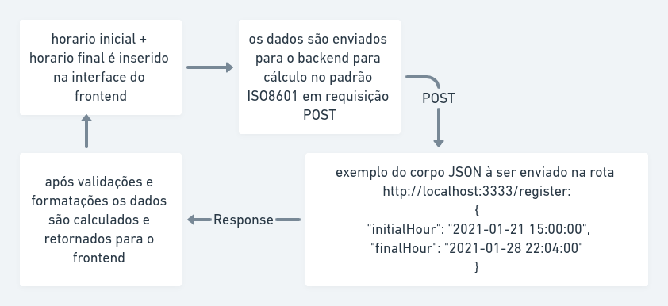

<h1 align="center">
  
</h1>

<h3 align="center">
  Aplicação em ReactJS para o desafio da Proveu
</h3>

<p align="center">Calculadora de jornada de trabalho!</p>

<p align="center">
  

  <a href="https://www.linkedin.com/in/diego-junges/" target="_blank" rel="noopener noreferrer">
    
  </a>

  

  <a href="https://github.com/DiegoJunges/gobarber-web/commits/master">
    
  </a>

  <a href="https://github.com/DiegoJunges/gobarber-web/issues">
    
  </a>

  
</p>

<p align="center">
  <a href="#%EF%B8%8F-about-the-project">About the project</a>&nbsp;&nbsp;&nbsp;|&nbsp;&nbsp;&nbsp;
  <a href="#-technologies">Technologies</a>&nbsp;&nbsp;&nbsp;|&nbsp;&nbsp;&nbsp;
  <a href="#-getting-started">Getting started</a>&nbsp;&nbsp;&nbsp;|&nbsp;&nbsp;&nbsp;
  <a href="#-how-to-contribute">How to contribute</a>&nbsp;&nbsp;&nbsp;|&nbsp;&nbsp;&nbsp;
  <a href="#-license">License</a>
</p>

</br>


## 💇🏻‍♂️ About the project

Aplicação frontend para o desafio da Proveu

Para ver a **api**, clique aqui: [Desafio Proveo Rest API](https://github.com/DiegoJunges/desafio-proveu-backend)</br>


## 🚀 Tecnologias

Technologies that I used to develop this web client

- [ReactJS](https://reactjs.org/)
- [TypeScript](https://www.typescriptlang.org/)
- [React Router DOM](https://reacttraining.com/react-router/)
- [React Icons](https://react-icons.netlify.com/#/)
- [Styled Components](https://styled-components.com/)
- [Polished](https://github.com/styled-components/polished)
- [Axios](https://github.com/axios/axios)
- [Eslint](https://eslint.org/)
- [Prettier](https://prettier.io/)
- [EditorConfig](https://editorconfig.org/)

## 💻 Getting started

### Requirements

- Tenha o backend desta aplicação [API](https://github.com/DiegoJunges/desafio-proveu-backend) rodando.

**Clone o projeto e acesse a pasta**

```bash
$ git clone https://github.com/DiegoJunges/desafio-proveu-frontend.git && cd desafio-proveu-frontend
```

**Siga os passos a seguir**

```bash
# Instale as dependencias
$ yarn

# Tenha certeza que o arquivo: 'src/services/apiClient.ts' tenha o IP da sua API

# Inicie o client
$ yarn start
```

## 🤔 Como contribuir

**Faça um fork deste repositório**

```bash
# Fork usando a linha de comando oficial do GitHub
# Se você não tem o GitHub CLI, use o website para fazer isso.

$ gh repo fork DiegoJunges/desafio-proveu-frontend
```

**Follow the steps below**

```bash
# Clone seu fork
$ git clone your-fork-url && cd desafio-proveu

# Crie uma branch com sua 'feature'
$ git checkout -b my-feature

# Façã um commit com suas mudanças
$ git commit -m 'feat: My new feature'

# Envie o código para sua branch remota
$ git push origin my-feature
```

Depois que seu PR for 'merged', você pode deletar sua branch

## 📝 License

This project is licensed under the MIT License - see the [LICENSE](LICENSE) file for details.

---

Made with 💜 by Diego Junges 👋 [See my linkedin](https://www.linkedin.com/in/diego-junges/)
